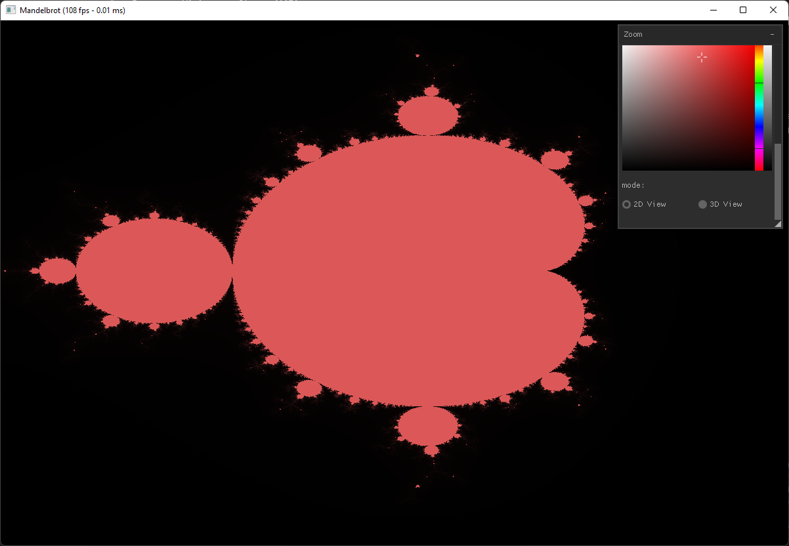
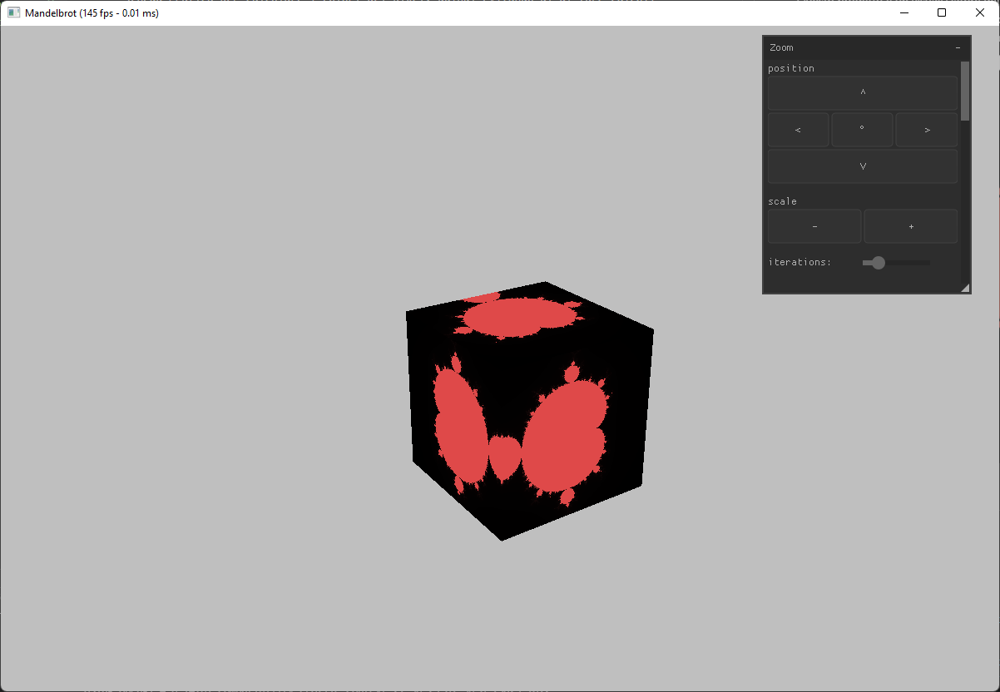
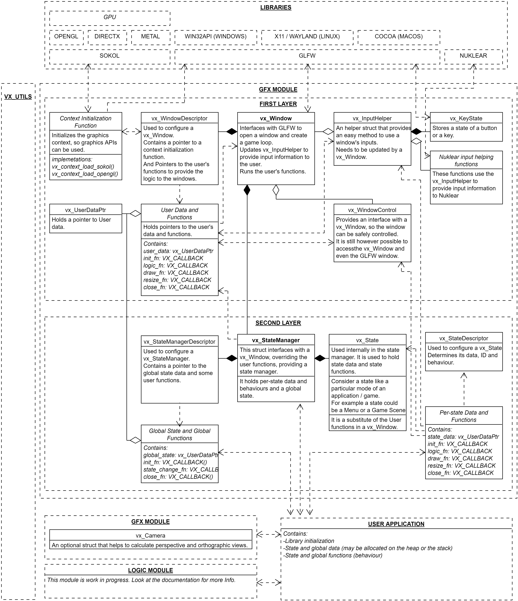
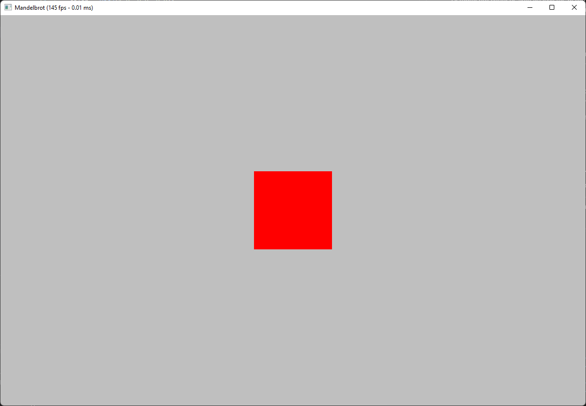
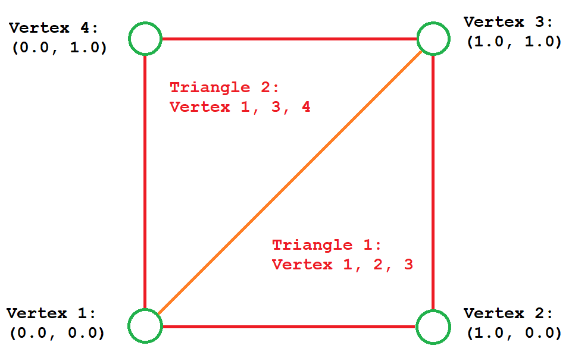
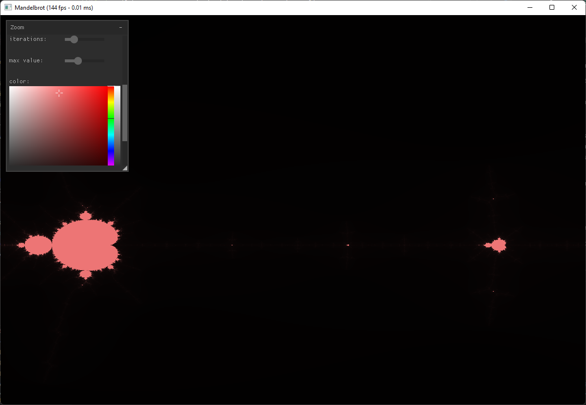
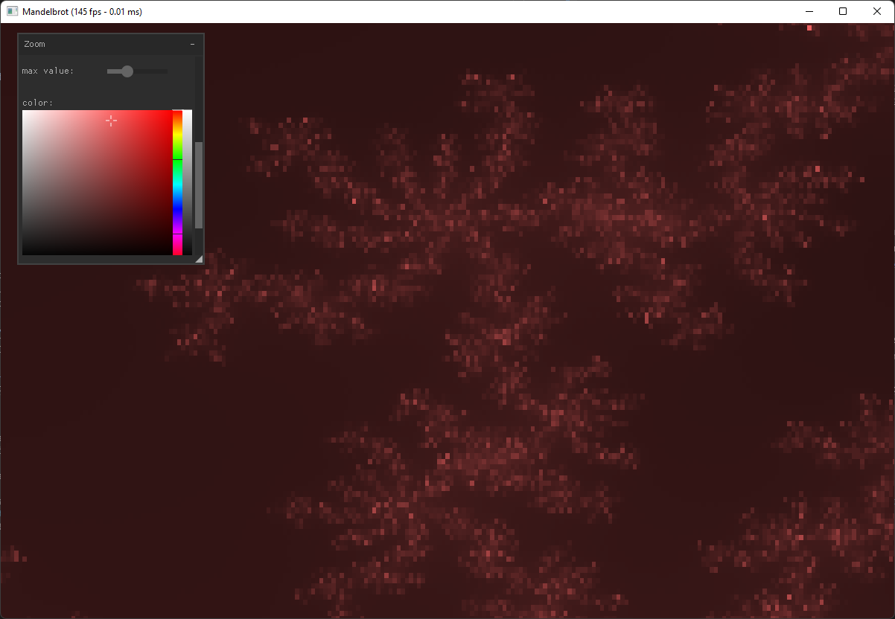

# <b>Visualizzatore del frattale di Mandelbrot</b>
Lavoro per Tecnologie  
Francesco Viciguerra Classe 4^AIA
===

# Premessa
Questo progetto è un visualizzatore del frattale di Mandelbrot scritto totalmente in C99.  
Esso utilizza solo la scheda grafica per determinare i colori dei pixel, quindi evita di di fare calcoli utilizzando la CPU.  
Nell'applicazione è presente una modalità di visualizzazione in 2d ed una modalità in 3d, mappando il frattale ad un cubo, sfruttando la potenza della GPU.  
Sebbene possa sembrare che il visualizzatore sia la parte principale del progetto, in realtà quest'ultimo serve solo per dimostrare il funzionamento del framework custom con il quale è stato costruito.  
Il lavoro è stato pertanto incentrato in tale libreria.




# Introduzione
Come spiegato nella premessa, l'applicazione è stata costruita utilizzando una libreria custom. Verranno quindi spiegati prima di tutto le scelta del linguaggio e delle dipendenze utilizzate ed il funzionamento del framework.  
Si ricorda che il visualizzatore utilizza la scheda grafica per i propri calcoli, perciò verrà anche fatta una <i>"veloce"</i> spiegazione sul come quest'ultimo è renderizzato.  
Infine sarà possibile analizzare cosa sono i frattali, per poi analizzare l'app vera e propria.

Si fa notare infine che il codice è <i>per la maggior parte</i> commentato (in special modo i file <i>header</i>, quindi se si hanno questioni sul funzionamento del programma è possibile sempre consultare il codice sorgente a [questo link](https://github.com/BlackHole00/Mandelbrot)).

### Nota alla lettura da PDF
L'intero documento è stato scritto in `markdown`, che fornisce una migliore esportazione HTML. E'preferibile leggere la documentazione a [questo link](https://github.com/BlackHole00/Mandelbrot/blob/master/docs/documentation-it.md).

---
# Attraverso lo Specchio
## Filosofie e Linguaggi
Prima di tutto è importante sapere che sono sempre stato interessato a linguaggi di programmazione a basso livello (quindi compilati), specificamente con allocazione manuale di memoria. E'sempre stato importante per me sapere esattamente come vengono convertite le informazioni e le funzioni dal codice al linguaggio macchina, dove e come vengono salvati i dati in memoria. Sebbene al giorno d'oggi la maggior parte di linguaggi sono interpretati o utilizzano metodi ottusi per gestire la memoria, ne rimangono sempre alcuni.

Molti utenti spesso pensano che più il linguaggio sia grande e complicato, più sia una migliore soluzione per i loro progetto, ma spesso capita di farsi trasportare dalle features <i>astratte</i> dei linguaggi di programmazione più complessi, aggiungendo al proprio codice dettagli e funzionamenti che portano solo più complessità ed illeggibilità, in cambio di una soluzione che può sembrare più <i>intelligente o astratta</i>.

Un ovvio esempio è l'operator overloading. Si consideri questo codice scritto in cpp, preso da un progetto scolastico:
``` cpp
  NumeroNaturale f(1);
  std::cout << !f << std::endl;
```
Ebbene, sapendo che la classe `NumeroNaturale` rappresenta un numero e che quest'ultima è inizializzata a `1`, quale dovrebbe essere il risultato di `!f`? Secondo pura logica si dedurrebbe che `!1` = `0`. Questa assunzione è errata. L'operatore `!` in questo codice ritorna il fattoriale del numero. Questo comportamento è impossibile da determinare senza precedente conoscenza del programma. C'è una chiara mancanza di leggibilità.  
Questo non è il solo problema: non è chiaro se sia in primo luogo chiamata un funzione che possa modificare i valori nel codice.

Secondo la mia filosofia il linguaggio di programmazione perfetto avrebbe bisogno delle seguenti caratteristiche:
- <b>semplicità</b>. L'intero linguaggio deve poter essere apprendibile da un comune mortale in una tempistica accettabile;
- <b>chiarezza nella chiamata delle funzioni</b>: se un codice non sembra che debba chiamare una procedura non deve chiamarla;
- <b>chiarezza e consistenza nello stile</b>: un linguaggio dovrebbe essere bello da vedere e non ci si dovrebbe mai chiedere cosa un determinato simbolo o espressione faccia.
- <b>un programma serve solo a trasformare dati in altri dati. Un dato non è altro che uno spazio in memoria.</b>

Di tutti i linguaggi da me analizzati il più vicino che si avvicina a questa ideologia è il linguaggio C. Si aggiunge però che quest'ultimo è lontano dall'essere perfetto. Il suo più grande problema è la mancanza dei template (che tutta via può essere ottenuto con l'utilizzo delle macro).

Sono stati considerati e scartati i seguenti linguaggi:
- [`BetterC subset of D`](https://dlang.org/spec/betterc.html): la migliore alternativa, ma, come D, è molto incentrato sul concetto di RAII (Resource Acquisition Is Initialization), che non considero necessario per il mio stile di programmazione.
- [`Zig`](https://ziglang.org/): un linguaggio con grande enfasi sull'esecuzione di codice al tempo di compilazione e sull'integrazione con il linguaggio C. Tuttavia utilizza una sintassi ed un module-system non ottimali e pieni di piccole stranezze. Inoltre è ancora un progetto immaturo, non ancora adatto a grandi lavori.
- [`Odin`](https://odin-lang.org/): il linguaggio più simile al C. Utilizza una sintassi molto innovativa e semplice. Tuttavia manca di un sistema che possa possa sostituire o porre una viabile alternativa alle macro del linguaggio C. Infine, come Zig, è ancora immaturo.
- [`C3`](https://www.c3-lang.org/): evoluzione spirituale del linguaggio C. Prova ad espanderlo mantenendone la stessa filosofia. Tuttavia penso che si sia spinto troppo lontano dai concetti originari. Come Zig ed Odin è ancora immaturo.
- [`Jai`](https://www.youtube.com/playlist?list=PLmV5I2fxaiCKfxMBrNsU1kgKJXD3PkyxO): il linguaggio che più si avvicina alle mie caratteristiche ideali. Utilizza una sintassi molto simile ad Odin e permette di eseguire grandi parti di codice al tempo della compilazione ([addirittura un intero gioco](https://youtu.be/UTqZNujQOlA?t=2639)). Tuttavia è ancora in sviluppo ed è in closed beta.

Si ricorda infine che il linguaggio C ha vari compilatori, varianti e dialetti. Per questo progetto è stato utilizzato il compilatore `gcc`. Ed è stato scelto il dialetto `C99`, in quanto è abbastanza moderno e non ho motivo per utilizzare standard più aggiornati. L'unica feature utilizzata non conformante agli standard è l'uso dell'operatore `typeof`, che è utilizzato solo per migliore debugging e può essere disabilitato attraverso un `#define`.

---
# Dipendenze
## CMake e Ninja
Il linguaggio di programmazione C, in termini di sistema di build, è molto datato.  
Senza sistemi esterni creare un eseguibile con file molteplici e librerie esterne è tedioso: è necessario indicare al compilatore le locazioni dei file esterni e delle librerie, per poi compilare ogni singolo sorgente in molteplici file oggetto. Allora bisogna effettuare un processo chiamato linking, prestando attenzione ad includere i giusti file ed utilizzare i giusti parametri.

Molti linguaggi moderni sono in grado di fare questi passaggi in modo trasparente, ma il linguaggio C non ne è in grado.

Viene in aiuto allora un tool esterno chiamato CMake che permette di, attraverso file di configurazione nominati `cmakelists.txt`, compilare facilmente ed in maniera trasparente. Si fa notare inoltre che CMake è in grado di utilizzare molti compilatori e build-system.

Nel progetto è stato utilizzato, grazie a CMake, un build-system chiamato ninja. Quest'ultimo permette di compilare in parallelo il progetto, migliorando abissalmente i tempi di compilazione. Tutto il progetto, comprese librerie esterne, è perciò molto veloce a generare un eseguibile: sono necessari meno di 15 secondi sul mio PC di lavoro.

Si ricorda inoltre che la compilazione progressiva è supportata sia da CMake che da ninja, perciò non è necessario ricompilare i file che non sono stati cambiati, migliorando ulteriormente i tempi per le compilazioni successive alla prima.

## Dare super poteri al linguaggio C: VxUtils
VxUtils è l'unica libreria esterna creata dal sottoscritto.

Quest'ultima serve per ampliare il linguaggio c, con intelligente uso di macro o di features non molto conosciute, ma conformanti agli standard. Oltre a questo offre molteplici funzioni e strutture per facilitare la risoluzione di certi problemi.

La libreria porta le seguenti features:
- migliori tipi, come `u32`, `i16` o `f32`, per poter determinare la grandezza in memoria facilmente;
- funzioni per la facile lettura di file;
- utilities per la gestione della memoria (in particolare versioni safe di `malloc` e `realloc`);
- migliore chiarezza per i puntatori a funzione, insieme a funzioni per renderli più sicure. Per esempio:
> ``` c
>   i32 add(f32 a, i32 b) {
>       return b + a; 
>   }
>
>   i32 main() {
>       /* func è un puntatore a funzione che ritorna un i32 e prende
>        * un f32 ed un i32. Internamente il tipo viene convertito in 
>        * `int (*func)()`. 
>        */
>       VX_CALLBACK(func, i32, f32, i32) = add;
>
>       /* Per maggiore chiarezza è anche possibile nominare i parametri 
>        * del callback. 
>        */
>       VX_CALLBACK(func2, i32, f32 a, i32 b) = add;
>
>       /* Può capitare che un puntatore a funzione sia NULL, come nel 
>        * seguente caso: 
>        */
>       VX_CALLBACK(illegal_fn, void) = NULL;
>       /* La seguente funzione farebbe quindi crashare il programma se 
>        * lasciata non commentata. 
>        */
>       // illegal_fn();
>
>       /* `VX_SAFE_FUNC_PTR` è in grado di convertire tale puntatore 
>        * in uno che possa essere chiamato. 
>        */
>       illegal_fn = VX_SAFE_FUNC_PTR(illegal_fn);
>       /* Ora `illegal_fn` è ora chiamabile. */
>       illegal_fn();
>   }
> ```
- migliori controlli e asserzioni per la modalità release e per la modalità debug. Per esempio:
> ``` c
>   typedef struct Stuff {
>       i32 a;
>   } Stuff;
>
>   i32 stuff_func(Stuff* stuff) {
>       /* In questa funzione stuff non può essere NULL: deve essere
>        * inizializzato. E'possibile utilizzare `VX_NULL_ASSERT` che
>        * crea un eventuale errore a run time se in modalita'di debug.
>        */
>       VX_NULL_ASSERT(stuff);
>       /* Similarmente se si preferisce che il codice non si fermi è
>        * possibile utilizzare `VX_NULL_CHECK`, che ritornerà eventualmente
>        * un valore di default, non prima di aver inviato un messaggio di
>        * warning.
>        */
>       VX_NULL_CHECK(stuff, 0);
>
>       return stuff->a;
>   }
>
>   void func() {
>       /* Questa funzione non è stata completata dal programmatore. Se
>        * chiamata quest'ultima farà cashare il programma.
>        */
>       VX_UNIMPLEMENTED(); 
>   }
>
>   i32 main() {
>       /* Questo main mostrerà anche controlli più semplici. */
>       i32 a = 0;
>       a += 1;
>       /* Errore condizionale. */
>       VX_ASSERT("a non e'1", a == 1);
>
>       a = 3;
>       if (a==4) {
>           /* Errore non condizionale. */
>           VX_PANIC("Non dovremmo essere qui!");
>       }
>
>       VX_DBG_PANIC(
>           "Questo messaggio verra' mostrato solo in modalita'debug!"
>       );
>   }
> ```
- creazione di valori di default specifichi per un tipo:
> ``` c
>   /* Definizione di una struttura d'esempio. */
>   typedef struct Struct {
>       i32 foo;
>       f32 bar;
>       char* baz;
>   } Struct;
>
>   /* Creazione del default. */
>   VX_CREATE_DEFAULT(Struct,
>       .foo = 123,
>       /* Nested defaults supported. */
>       .bar = VX_DEFAULT(f32),
>       .baz = NULL
>   )
>
>   i32 main() {
>       VX_ASSERT("VX_DEFAULT(u32) must be 0!", VX_DEFAULT(u32) == 0.0f);
>
>       Struct s = VX_DEFAULT(Struct);
>       VX_ASSERT(
>           "foo must be 123 and baz must be NULL!",
>           s.foo == 123 && s.baz == NULL
>       );
>   }
> ```
- macro per la <i>facile</i> creazione di funzioni e strutture dati che necessitano di un template. Questo viene ottenuto utilizzando l'operatore di concatenazione `##`. Alcuni esempi sono:
> ``` c
>   /* Creazione di una struttura generica. Il nome della struttura 
>    * generata sara' `Struct_T` dove T e'il nome del tipo. Per esempio 
>    * con u32: `Struct_u32`.
>    */
>   #define _STRUCT_ELEM(T) typedef struct VX_TEMPLATE_NAME(T, Struct) {\
>       T elem;\
>   }
>
>   /* Creazione di una funzione per ottenere elem da Struct. Il nome
>    * della funzione generata sara' `struct_get_elem_T`, dove T e'il
>    * nome del tipo. Per esempio con u32: `struct_get_elem_u32`.
>    */
>   #define _STRUCT_GET_ELEM_INL(T) T VX_TEMPLATE_NAME(T, struct_get_elem)(VX_TEMPLATE_NAME(T, Struct)* struct) {\
>       return struct->elem;
>   }
>
>   /* Macro di aiuto per implementare un tipo: */
>   #define _GEN_STRUCT_FOR_TYPE(T) _STRUCT_ELEM(T) \
>       _STRUCT_GET_ELEM_INL(T)
>
>   /* Implementazione per `u32`. */
>   _GEN_STRUCT_FOR_TYPE(u32)
>
>   /* Main per testing. */
>   i32 main() {
>       /* VX_T e'la versione piu'corta di VX_TEMPLATE_NAME. */
>       VX_T(u32, Struct) s;
>       s.elem = 30;
>
>       VX_ASSERT("Test!", VX_T(u32, struct_get_elem)(&s) == 30);
>   }
> ```
- un implementazione di un vettore dinamico e di una hashmap entrambi con template. Per esempio:
> ``` c
> i32 main() {
>   /* Creazione di un vettore di interi. */
>   VX_T(i32, vx_Vector) vec = VX_T(i32, vx_vector_new)();
>
>   /* Inserimento di dati nel vettore. */
>   VX_T(i32, vx_vector_push)(&vec, 5);
>   VX_T(i32, vx_vector_push)(&vec, 3);
>   VX_T(i32, vx_vector_push)(&vec, 1);
>
>   /* Ciclo foreach. la variabile I viene definita dalla macro. */
>   VX_VECTOR_FOREACH(i32, elem, &vec, 
>     printf("elemento %d: %d\n", I, elem);
>   )
>
>   /* Ottenimento del secondo elemento. VX_VD. */
>   VX_ASSERT("Test", VX_VD(&vec)[1] == 3);
>
>   /* Deinizializzazione del vettore. */
>   VX_T(i32, vx_vector_free)(&vec);
>
>   /* Creazione di un'HashMap di interi. La key e'sempre un intero 
>    * unsigned a 64 bit.
>    */
>   VX_T(i32, vx_HashMap) map = VX_T(i32, vx_HashMap)();
>
>   /* Inserimento valori. Il primo parametro è il valore, il secondo 
>    * è una chiave.
>    */
>   VX_T(i32, vx_hashmap_insert)(&map, 100, 0);
>   VX_T(i32, vx_hashmap_insert)(&map, 999, 3);
>
>   /* Richiesta valori. */
>   VX_ASSERT("Test!", VX_T(i32, vx_hashmap_get)(&map, 3) == 999);
>
>   /* Rimozione valori. */
>   VX_T(i32, vx_hashmap_remove)(&map, 3);
>
>   /* deinizializzazione della memoria. */
>   VX_T(i32, vx_hashmap_free)(&map);
> }
> ```

## [GLFW](https://www.glfw.org/)
GLFW <i>(Graphics Library FrameWork)</i> è una libreria che fornisce un'API di basso livello per gestire l'apertura e gli input di una finestra, indipendentemente dal sistema operativo utilizzato.

E'necessario notare che la libreria da sola è pienamente utilizzabile, ma il framework offre un wrapper apposito di alto livello che gestisce gli input in modo migliore e fornisce un semplice metodo per creare un game-loop.

## [HandmadeMath](https://github.com/HandmadeMath/Handmade-Math)
HandmadeMath è una semplice libreria per la matematica e l'algebra lineare utilizzata per i calcoli necessari per le proiezioni prospettiche e ortografiche nelle varie modalità di visualizzazione dell'applicazione.  
Viene anche utilizzata per il movimento della videocamera nella modalità 3d.

## [Sokol](https://github.com/floooh/sokol)
Sokol è una libreria wrapper, utilizzata per disegnare sullo schermo sfruttando la scheda grafica.

Quest'ultima si interfaccia ad altre librerie come `DirectX`, `Metal`, `OpenGL` e `WebGpu`, le quali sono in grado di <i>parlare</i> direttamente con i driver della GPU, ma sono dipendenti dal sistema operativo (`DirectX` e `Metal`) o sono spesso [pieni di bug](https://users.rust-lang.org/t/glium-post-mortem/7063) a seconda del proprio hardware (`OpenGL`).

Si nota però che Sokol rimane comunque molto a basso livello e non fornisce quasi alcuna astrazione in più rispetto alle API menzionate sopra.

## [Glad](https://glad.dav1d.de/)
Per vantaggi legati al debug del codice ed alla velocità di compilazione, Sokol è stato configurato per utilizzare `OpenGL`. Quest'API tuttavia presenta il problema di avere un'inizializzazione particolare (diversamente dalle altre). Per questo è necessaria una libreria per fare questo lavoro. Glad ( ) è in grado di farlo.

## [Nuklear](https://github.com/Immediate-Mode-UI/Nuklear)
Nuklear è una libreria che fornisce una <i>immediate-mode GUI</i>. Quest'ultima è in grado, una volta forniti in input i dati necessari di generare informazioni (<i>buffer</i>) leggibili dalla scheda grafica che possono essere, con la giusta implementazione, renderizzate indipendentemente dalle librerie utilizzate.  
Si nota tuttavia che non è presente nessuna implementazione recente che usa Sokol e GLFW, quindi è stato necessario scriverne una per questa configurazione. Quest'ultima è stata poi modificata per utilizzare i migliori metodi di input del framework.

---
# Il Framework (dovrei probabilmente trovare un nome migliore)
Il framework è una libreria costruita al di sopra delle precedenti menzionate dipendenze. Il suo compito è quello di creare un modo per aprire facilmente una finestra e creare un game-loop, con la minore frizione possibile.

Al momento della scrittura quest'ultimo tuttavia non offre ancora sistemi avanzati per la gestione della logica dell'applicazione (non possiede nessun <i>Entity Component System</i> o un <i>Resource Manager</i>) ed, oltre alla camera, non offre nessuna struttura di supporto per il rendering (quindi non esiste un <i>Renderer</i>).  
Eventualmente tutti questi sistemi verranno implementati.

La libreria è divisa correntemente in tre parti:
- `OS` module: gestisce le finestre e gli input.
- `GFX` module: contiene le cose dedicate al rendering (al momento contiene solo la `camera`).
- `LOGIC` module: contiene strutture utili per generare la logica dell'applicazione (al momento è ancora piccolo ed in ideazione).

Verranno spiegati tutti i moduli, ma per una visione collettiva del lavoro è consigliabile tenere in mente il seguente schema pseudo-UML (l'immagine è disponibile a [questo link](https://github.com/BlackHole00/Mandelbrot/blob/master/docs/imgs/framework_uml.png)):



# OS MODULE
Come detto prima questo modulo si occupa di creare una finestra, di ottenere gli input e di creare un game loop. E'anche disponibile uno State Manager per facile gestione di applicazioni complesse.  
Quest'ultimo si interfaccia con GLFW per ottenere questi obiettivi. Si nota però che si interfaccia anche con Sokol e Nuklear per alcune piccole cose.  
Il modulo OS è diviso in ulteriori due parti:
- First Layer
- Second Layer

## First Layer
Questo strato è il primo. Provvede astrazioni per interfacciarsi con GLFW, Sokol e Nuklear. Provvede strutture quindi per gestire una finestra, per gestire l'input e per gestire un game loop.  
In questo layer tale game loop viene creato attraverso l'uso di puntatori a funzione salvati in `vx_Window`, che vengono chiamati agli opportuni momenti, con i giusti parametri. L'utente può anche definire un puntatore ai propri dati, evitando di utilizzare variabili globali.  
Queste sono le funzioni di callback che un'applicazione può implementare:
- `void init(vx_UserStatePtr data_ptr, vx_WindowControl* window_control)`: chiamata all'inizializzazione dei dati. Prima dell'esecuzione del game loop.
- `void logic(vx_UserStatePtr data_ptr, vx_WindowControl* window_control, vx_WindowInputHelper* input_helper)`: chiamata ogni frame per gestire la logica del gioco. Non dovrebbe essere utilizzata per disegnare nulla.
- `void draw(vx_UserStatePtr data_ptr)`: chiamata ogni frame. Utilizzata esclusivamente per disegnare. Il motivo della divisione da `logic` è per la chiarezza. E' molto più facile seguire il codice se la logica è divisa dal disegno. Se, tuttavia, il programmatore lo desidera può comunque inserire codice di rendering in `logic` senza nessun problema.
- `void resize(vx_UserStatePtr data_ptr, vx_WindowControl* window_control, u32 width, u32 height)`: chiamata quando la finestra viene ridimensionata.
- `void close(vx_UserStatePtr data_ptr)`: chiamata quando viene richiesta la chiusura di una applicazione.

### vx_Window
Questa struttura è la più importante di tutto il layer. Si occupa di interfacciarsi con GLFW per creare una finestra ed utilizzare puntatori a funzioni per la logica dell'utente.  
Per utilizzare questa finestra sono necessari due passaggi: Una prima inizializzazione della struttura, utilizzando `vx_window_new()` insieme ad un descrittore chiamato `vx_WindowDescriptor`. Quest'ultimo contiene la configurazione desiderata della finestra (per esempio titolo, grandezza, fullscreen...), un puntatore a funzione per inizializzare il context ed i callback mostrati nel paragrafo precedente.  
Successivamente è necessario dire alla finestra di cominciare l'esecuzione, chiamando `vx_window_run`, la quale utilizza i vari callback.  

Il funzionamento della prima fase è il seguente:
- <b>inizializzare GLFW</b> se non è già stata inizializzata
- <b>creare una finestra</b> utilizzando gli attributi desiderati
- <b>inizializzare il context</b>: inizializza il context grafico utilizzando il puntatore a funzione. Di default viene inizializzato Sokol ed OpenGl, utilizzando Glad. Si veda la sezione di quest'ultima per informazioni più dettagliate. Si nota che l'utente è libero di creare una propria funzione per questo lavoro, quindi l'eventuale uso di librerie simili di terze parti è consentito e supportato.

Nella seconda fase invece sono eseguiti i seguenti passi:
- <b>inizializzazione dei dati dell'utente</b> (chiamata alla funzione `init`)
- <b>per ogni frame</b>, finché non viene richiesta l'uscita:
> - <b>calcolo dei frame al secondo</b> e visualizzazione sulla barra del titolo se richiesto
> - <b>aggiornamento degli input</b> (aggiornando `vx_InputHelper`)
> - <b>chiamata delle funzioni `logic` e `draw`</b> per l'esecuzione dell'applicazione
- <b>chiamata della funzione `close`</b>
- <b>distruzione della finestra</b> e deinizializzazione di GLFW.

### vx_WindowInputHelper
`vx_WindowInputHelper` è una struttura che permette all'utente di facilmente ottenere informazioni sull'input.  
Si nota che questa struttura non legge gli input automaticamente, quindi viene aggiornato dalla finestra ogni frame prima della chiamata della funzione `logic`.

Gli input da parte dell'utente possono essere ottenuti accedendo ai seguenti fields:
- `delta_time`: il tempo passato dall'ultimo frame
- `mouse`: tutte le informazioni legate ai dati del mouse. In particolare `position_x`, `position_y` e `mouse_buttons`.
- `keys`: lo stato dei pulsanti della tastiera.

Si nota tuttavia che `keys` e `mouse.mouse_buttons` sono vettori di `vx_KeyState`. Per accedere alle informazioni di una determinato pulsante è necessario utilizzare i codici di GLFW come indici.

Per esempio porre questo codice nella funzione `logic` farebbe scrivere nella console `"Ciao"` ad ogni frame se si preme la space bar:
> ``` c
> if (input_helper->keys[GLFW_KEY_SPACE].pressed) {
>   printf("Ciao\n");
> }
> ```

La funzione `vx_inputhelper_update_nuklear_input()` utilizza l'input helper per inviare gli input a Nuklear.

### vx_WindowControl
Questa struttura permette di controllare una `vx_Window` senza interfacciarsi direttamente su di essa.  
Questo permette di diminuire il numero di bug nel caso di operazioni che la libreria non si aspetta. L'utente può comunque accedere alla finestra `vx_Window` ed addirittura a quella GLFW se lo desidera.  
Si nota che se l'utente ha tuttavia bisogno di fare queste operazioni la libreria dovrebbe essere modificata in modo da, sempre nel rispetto della semplicità, offrire un metodo utilizzando `vx_WindowControl`.  
Alcune interessanti funzioni sono:
- `vx_windowcontrol_exit()`: richiede la chiusura dell'applicazione
- `vx_windowcontrol_set_mouse_grab()`: richiede alla finestra di "grabbare" in mouse

### Esempio di un'applicazione minimale
Questa semplice applicazione (che non disegna nulla sullo schermo), è un esempio per meglio comprendere il funzionamento del primo layer della libreria.  
Quest'ultimo stamperà sulla console un numero che può essere incrementato premendo `SPACE` e decrementato premendo `SHIFT`. E'possibile chiudere l'applicazione premendo `ESCAPE`.

> ``` c
>   #include <stdio.h>
>   #include <os/os.h>
>
>   /* GameState: struttura che mantiene i dati dell'applicazione. */
>   typedef struct GameState {
>       i32 number;
>   } GameState;
>
>   /* Chiamata all'inizializzazione. */
>   void init(GameState* game_state, vx_WindowControl* window) {
>       game_state->number = 0;
>   }
>
>   /* Chiamata ad ogni frame. */
>   void logic(GameState* game_state, vx_WindowControl* window, vx_WindowInputHelper* input) {
>       if (input->keys[GLFW_KEY_SPACE].just_pressed) {
>           game_state->number++;
>       } else if (input->keys[GLFW_KEY_LEFT_SHIFT].just_pressed) {
>           game_state->number--;
>       }
>
>       if (input->keys[GLFW_KEY_ESCAPE].just_pressed) {
>           vx_windowcontrol_exit(window);
>       }
>   }
>
>   /* Chiamata ad ogni frame. */
>   void draw(GameState* game_state) {
>       printf("Number: %d\n", game_state->number);
>   }
>
>   /* Chiamata alla chiusura dell'applicazione. */
>   void close(GameState* game_state) {
>       printf("Closing!!! The number was: %d\n", game_state->number);
>   }
>
>   i32 main() {
>     /* Creazione di un descrittore per creare la finestra. */
>     vx_WindowDescriptor desc = VX_DEFAULT(vx_WindowDescriptor);
>     desc.title = "Counter";
>     desc.init = init;
>     desc.logic = logic;
>     desc.draw = draw;
>     desc.close = close;
>     /* Funzione di resize omessa. Il programma non crashera'. */
>
>     /* Inizializzazione della finestra. */
>     vx_Window window = vx_window_new(&desc);
>
>     /* Potrebbe essere una buona idea allocare i game state sull'heap. */
>     GameState* game_state = vx_smalloc(sizeof(GameState));
>
>     /* Esecuzione applicazione. */
>     vx_window_run(&window, (vx_UserStatePtr)game_state);
>
>     free(game_state);
>
>     return 0;
>   }
> ```

## Second Layer
Sebbene la soluzione offerta dal primo layer possa sembrare molto modulare, essa è in realtà adatta solo a piccoli progetti.  
Quando si vuole avere grandi applicazioni l'astrazione presente non è più sufficiente.  

Il secondo layer offre un'ulteriore livello di astrazione totalmente opzionale che si basa sull'utilizzo di una finestra già creata.  
E'stata quindi inserita una nuova struttura chiamata `vx_StateManager`, che è appunto un gestore di stati dell'applicazione.  
Si pensi ad uno stato come un particolare momento dell'applicazione. Si prenda per esempio un videogioco: quest'ultimo è formato da molte parti diverse, come un Menù e la scena di gioco. Ecco non c'è nessun motivo per il menù di contenere tutto il codice ed i dati necessari al gioco e, viceversa, il gioco non ha bisogno delle informazioni del menu.

Uno stato è quindi un vero e proprio stato dell'applicazione che è distinto dagli altri stati dell'applicazione, ma ne può comunque comunicare. Ad ogni stato sono quindi associate tali informazioni:
- un UID: un identificatore universale. Può essere una costante o un'hash di una stringa.
- un puntatore alla memoria utilizzata per i dati
- varie funzioni di callback simili a quelle di `vx_Window`:
> - `void init(vx_UserStatePtr global_data_ptr, vx_UserStatePtr data_ptr, vx_WindowControl* window_control)`
> - `vx_StateUID logic(vx_UserStatePtr global_data_ptr, vx_UserStatePtr data_ptr, vx_WindowControl* window_control, vx_WindowInputHelper* input_helper)`: ritorna l'UID dello stato che deve essere eseguito il prossimo frame.
> - `void draw(vx_UserStatePtr global_data_ptr, vx_UserStatePtr data_ptr)`
> - `void resize(vx_UserStatePtr global_data_ptr, vx_UserStatePtr data_ptr, vx_WindowControl* window_control, u32 width, u32 height)`
> - `void close(vx_UserStatePtr global_data_ptr, vx_UserStatePtr data_ptr)`

Con l'implementazione attuale non è tuttavia possibile eseguire molteplici stati contemporaneamente. Supporto per tale feature è previsto, una volta che la libreria verrà resa multithread-safe.

Si può pensare che tale implementazione sia completa, ma manca ancora un metodo per scambiare i dati attraverso gli stati. La libreria offre quindi la possibilità di definire uno stato globale, che può essere accesso sempre.  
Sono anche offerte le seguenti funzioni aggiuntive:
- `void first_init(vx_UserStatePtr global_data)`: utilizzata per inizializzare lo stato globale.
- `void state_change(vx_UserStatePtr global_data, vx_UserStatePtr prev_state_data, vx_StateUID new_state_UID, vx_StateUID old_state_UID)`: chiamata in un cambio di stato.
- `void last_close(vx_UserStatePtr global_data)`: chiamata alla chiusura del programma.

Si fa notare infine che la transizione da un'implementazione First-Layer a una Second-Layer è molto semplice: tutto il resto della libreria è utilizzabile senza cambiamenti e le funzioni della logica possono essere riutilizzate senza maggiori riscritture.

### vx_StateManager
Come detto nel paragrafo precedente, `vx_StateManager` è una struttura che si occupa di gestire i vari stati (internamenti chiamati `vx_State`).  
Quest'ultima utilizza un'hash map per salvarli in memoria ed utilizza una finestra `vx_Window` come base, infatti ne sovrascrive i callback per utilizzare i propri. Si enfatizza che l'utente non ha bisogno di questi ultimi se utilizza una soluzione Second-Layer: quest'ultimo può utilizzare gli stati.

Come `vx_Window`, `vx_StateManager` può essere configurato utilizzando il descrittore `vx_StateManagerDescriptor`, che contiene un puntatore ai dati globali e alle funzioni `first_init`, `state_change`, `last_close`.

Sarà possibile poi inserire stati utilizzando `vx_statemanager_register_state()`, insieme ad al descrittore `vx_StateDescriptor`, il quale contiene, similarmente a `vx_StateManagerDescriptor`, un puntatore ai dati dello stato ed alle funzioni `init`, `logic`, `draw`, `resize` e `close`, ma anche il proprio UID.

E'possibile successivamente chiamare `vx_statemanager_run()` per eseguire l'applicazione. Una volta fornita una finestra e l'UID del primo stato, la chiamata di questa funzione causerà i seguenti passi:
- <b>sovrascrittura dei callback</b> della finestra passata come parametro
- <b>esecuzione della finestra</b> (stile First-Layer). I nuovi callback eseguiranno rispettivamente le seguenti istruzioni:
> - `init`: chiamerà `first_init` (per inizializzare i dati globali) e la funzione `init` del primo stato.
> - `logic`: chiamerà la funzione `logic` dello stato attuale ad ogni frame. Eventualmente ad un cambio di stato chiamerà `close` (sul vecchio stato), `state_change` e `init` (per il nuovo stato).
> - `draw`: chiamerà `draw` dello stato attuale.
> - `resize`: chiamerà `resize` dello stato attuale.
> - `close`: chiamerà `close` dello stato attuale e `last_close` per pulire lo stato globale.

Diversamente da `vx_Window`, `vx_StateManager` alloca memoria sull'heap (per l'hash map), quindi prima della terminazione del programma è necessario chiamare `vx_hashmap_free()` per liberare la memoria allocata.

### Esempio di un'applicazione utilizzante gli stati
In questa sezione verrà riscritto l'esempio per il First-Layer utilizzando gli stati. Si fa notare che questo programma è solo a scopo dimostrativo: è molto più semplice nella sua iterazione precedente

Verranno utilizzati due stati: uno che incrementa il contatore ogni frame ed uno che lo diminuisce ogni frame. Sarà anche salvato il numero di volte che ogni stato viene utilizzato, per porre un esempio per le informazioni per-stato. E'possibile cambiare stato utilizzando la space bar.

> ```c
>   #include <stdio.h>
>   #include <os/os.h>
>
>   /* UIDs */
>   const vx_StateUID INC_MODE_UID = 0;
>   const vx_StateUID DEC_MODE_UID = 1;
>
>   /* Dichiarazione stati: GlobalState sarà sempre disponibile, */
>   /* IncModeState e DecModeState servono per gli stati. */
>   typedef struct GlobalState {
>       i32 number;
>   } GlobalState;
>
>   typedef struct IncModeState {
>       u32 increments;
>   } IncModeState;
>
>   typedef struct DecModeState {
>       u32 decrements;
>   } DecModeState;
>
>   /* Funzioni stato-indipendenti */
>   void first_init(GlobalState* global_state) {
>       global_state->number = 0;
>   }
>
>   void last_close(GlobalState* global_state) {
>       printf("The number is %d!!!\n", global_state->number);
>   }
>
>   /* Funzioni per lo stato di incremento. */
>   void incmodestate_init(GlobalState* global_state, IncModeState* state, vx_WindowControl* window) {
>       printf("Entering Increment state.\n");
>       state->increments = 0;
>   }
>
>   vx_StateUID incmodestate_logic(GlobalState* global_state, IncModeState* state, vx_WindowControl* window, vx_WindowInputHelper* input) {
>       if (input->keys[GLFW_KEY_ESCAPE].just_pressed) {
>          vx_windowcontrol_exit(window);
>       }
>       if (input->keys[GLFW_KEY_SPACE].just_pressed) {
>           return DEC_MODE_UID;
>       }
>       return INC_MODE_UID;
>   }
>
>   void incmodestate_draw(GlobalState* global_state, IncModeState* state) {
>       printf("Mode Increment: number = %d!\n", global_state->number);
>       global_state->number++;
>       state->increments++;
>   }
>
>   void incmodestate_close(GlobalState* global_state, IncModeState* state, vx_WindowControl* window) {
>       printf("Exiting Increment state. There has been %d increments!!!", state->increments);
>   }
>
>   /* Funzioni per lo stato di decremento. */
>   void decmodestate_init(GlobalState* global_state, DecModeState* state, vx_WindowControl* window) {
>       printf("Entering Decrement state.\n");
>       state->decrements = 0;
>   }
>
>   vx_StateUID decmodestate_logic(GlobalState* global_state, DecModeState* state, vx_WindowControl* window, vx_WindowInputHelper* input) {
>       if (input->keys[GLFW_KEY_ESCAPE].just_pressed) {
>          vx_windowcontrol_exit(window);
>       }
>       if (input->keys[GLFW_KEY_SPACE].just_pressed) {
>           return INC_MODE_UID;
>       }
>       return DEC_MODE_UID;
>   }
>
>   void decmodestate_draw(GlobalState* global_state, DecModeState* state) {
>       printf("Mode Decrement: number = %d!\n", global_state->number);
>       global_state->number--;
>       state->decrements++;
>   }
>
>   void decmodestate_close(GlobalState* global_state, DecModeState* state, vx_WindowControl* window) {
>       printf("Exiting Decrement state. There has been %d increments!!!", state->decrements);
>   }
>
>   i32 main() {
>       /* Creazione di un descrittore per creare la finestra. */
>       vx_WindowDescriptor desc = VX_DEFAULT(vx_WindowDescriptor);
>
>       /* Inizializzazione della finestra. */
>       vx_Window window = vx_window_new(&desc);
>
>       /* Potrebbe essere una buona idea allocare gli stati sull'heap. */
>       GlobalState* global_state = vx_smalloc(sizeof(GlobalState));
>       IncModeState* inc_mode_state = vx_smalloc(sizeof(IncModeState));
>       DecModeState* dec_mode_state = vx_smalloc(sizeof(DecModeState));
>
>       /* Creazione di uno state manager. */
>       vx_StateManager manager = vx_statemanager_new(&(vx_StateManagerDescriptor){
>           .first_init = first_init,
>           .close = last_close,
>           .global_data = global_state,
>       });
>
>       /* Registrazione stato di incremento. */
>       vx_statemanager_register_state(&manager, &(vx_StateDescriptor){
>           .UID = INC_MODE_UID,
>           .init = incmodestate_init,
>           .logic = incmodestate_logic,
>           .draw = incmodestate_draw,
>           .close = incmodestate_close,
>           .user_data = inc_mode_state,
>       });
>
>       /* Registrazione stato di decremento. */
>       vx_statemanager_register_state(&manager, &(vx_StateDescriptor){
>           .UID = DEC_MODE_UID,
>           .init = decmodestate_init,
>           .logic = decmodestate_logic,
>           .draw = decmodestate_draw,
>           .close = decmodestate_close,
>           .user_data = dec_mode_state,
>       });
>
>       /* Esecuzione dell'applicazione. */
>       vx_statemanager_run(&manager, &window, INC_MODE_UID);
>
>       /* Liberazione memoria */
>       vx_statemanager_free(&manager);
>       free(global_state);
>       free(inc_mode_state);
>       free(dec_mode_state);
>
>       return 0;
>   }
> ```

# GFX MODULE
Questo modulo, nel futuro conterrà strutture dati utili per rendere facile il rendering.  
Per esempio nel futuro saranno inseriti un allocatore di memoria per i buffer nella scheda grafica ed un renderer per facilmente gestire buffer, textures e framebuffers, quindi creando un [render graph](https://github.com/gfx-rs/gfx/wiki/Frame-graphs).

Al momento attuale contiene solo `vx_Camera`.

## vx_Camera
Questa struttura provvede una camera, che produce trasformazioni prospettiche o ortografiche che possono essere applicate dalla GPU.  
Il funzionamento preciso della camera non viene spiegato nella precisione, in quanto non è il principale scopo di questa documentazione. Se si vuole comunque una spiegazione si può consultare il seguente [link](https://learnopengl.com/Getting-started/Camera).

# LOGIC MODULE
Questo modulo contiene tutto quello che riguarda una possibile logica del gioco.

Al momento contiene solo un insieme di <i>componenti</i> che possono essere utilizzati per creare una semplice logica.  
Nel futuro verranno implementati molti sistemi, come un gestore di risorse, un task-scheduler ed eventualmente un [Entity Component System](https://en.wikipedia.org/wiki/Entity_component_system).

## Entità e Componenti
Per entità si intendono strutture dedicate alla logica del gioco che contengono componenti.  
Per componente si intende una struct per salvare un piccolo ammontare di informazioni legati ad un singolo aspetto dell'entità.

Il modulo, al momento attuale, provvede di default solo componenti legati alle trasformazioni (quindi posizione, rotazione e scala), ma, siccome un componente è una semplice struttura, è possibile aggiungerne altri facilmente.

Per esempio se si immagina un entità guerriero, sarà formata dai seguenti componenti:
- posizione
- vita
- danno

Ogni componente è indipendente dall'entità.

Si ricorda infine che è preferibile creare piccoli componenti che interagiscono tra di loro, evitando di crearne di grandi, che non sono modulari. Ci si allontana quindi da una classica struttura logica OOP ad <i>"albero"</i>, ma ci si avvicina ad un'astrazione altamente basata su <i>pseudo-inferface</i> e <i>pseudo-traits</i> (come incoraggia anche il linguaggio di programmazione [rust](https://www.rust-lang.org/)).

---
# Rendering sulla GPU, <i>aka: "Perché la mia finestra non disegna nulla?"</i>
Questa sezione offrirà una <i>"veloce"</i> spiegazione di come è possibile renderizzare un semplice quadrato utilizzando la scheda grafica. Si nota che verrà spiegato il funzionamento in generale, senza andare nel dettaglio per ogni specifica API o nel funzionamento di Sokol.

La teoria spiegata è facilmente applicabile a tutte le librerie, con cambiamenti logici non troppo grandi.

Questo sarà il risultato di quello spiegato:



Prima di cominciare si fa un piccolo riassunto dei passi necessari, che verranno spiegati nei parametri successivi:
- creazione di un <i>vertex buffer</i> e di un <i>index buffer</i>
- creazione, compilazione e linkaggio di una <i>vertex shader</i> e di una <i>fragment shader</i>
- definizione del formato dei buffer
- settaggio degli stati e binding degli elementi menzionati sopra
- chiamata di disegno

Si raccomanda di tenere in mente che la GPU è un grado di disegnare solo triangoli. Figure geometriche più complesse sono solo più triangoli messi assieme.  
Un quadrato è formato da due triangoli.

Infine si fa notare che un contenuto della finestra viene pulito ad ogni frame, quindi sarà necessario ripetere le ultime due fasi molteplici volte al secondo.

## Buffers
Un `buffer` è un ammasso di dati che vengono inviati alla scheda grafica. Questi ultimi determinano cosa viene disegnato.

Questi ultimi vengono divisi in molteplici categorie. Quelle che sono state utilizzate sono le seguenti:
- `vertex buffer`: contengono la posizione dei vertici nello schermo.
- `index buffer`: indica da quali vertici è formato un triangolo. Fa riferimento al `vertex buffer`.

Per esempio:



## Shader
Le `shaders` sono piccoli programmi che vengono eseguiti nella scheda grafica.  
Possono essere utilizzati in molte situazioni, ma le più comuni sono:
- `vertex shader`: processano la posizione dei vertici, come per esempio nel caso di applicare una trasformazione prospettica o, in un gioco più complesso, simulare il vento nelle foglie degli alberi.
- `fragment shader`: calcolare il colore di ogni singolo pixel di un determinato triangolo. Il visualizzatore di frattali utilizza questa shader per calcolare il set di Mandelbrot.

Queste ultime possono essere scritte in molti linguaggi, ma quello utilizzato nel progetto è `GLSL`.

Queste sono le shader utilizzate nell'esempio (rispettivamente vertex e fragment):
- <i>quad.vs</i>
> ``` glsl
>   #version 330
>
>   /* Acquisizione della posizione dei vertici dal buffer. */
>   layout(location=0) in vec2 position;
>
>   /* Funzione main: calcolo posizione dei vertici. */
>   void main() {
>       /* gl_Position e'una variabile built-in che indica la posizione
>        * del vertice. Vengono utilizzate le informazioni del buffer
>        * senza modifiche.
>        */
>       gl_Position = vec4(position, 1.0f);
>   }
> ```
- <i>quad.fs</i>
> ``` glsl
>   #version 330
>
>   /* Definizione variabile di uscita. */
>   out vec3 color;
>
>   /* Funzione main: calcolo del colore dei vertici. */
>   void main() {
>       /* Colore in formato RGB: rosso. */
>       color = vec3(1.0, 0.0, 0.0);
>   }
> ```

## Definizione del formato dei buffer
Sebbene le shader abbiano alcune informazioni sul formato dei buffer è necessario descrivere alla scheda grafica il formato di esso, quindi definire quali byte indicano quale data.

Nel caso dei vertici sopra citati i procedimento è semplice, ma se si intende inserire informazioni extra (come le coordinate di una texture o un colore aggiuntivo) è necessario fare qualche procedimento logico aggiuntivo, come il calcolo dei valori di offset nel buffer.

## Stati e bindings
Prima della chiamata del disegno è necessario fare in modo che siano utilizzati (quindi <i>bindati</i>) i giusti buffer, shaders e descrittori di formato.  
Se non vengono eseguite queste operazioni il programma potrebbe fermarsi, non disegnare nulla o renderizzare garbage-data sulla finestra.

La maggior parte degli errori avviene spesso in questa fase, in quanto non esistono facili metodi per il debug di questi problemi.

## Chiamata per il disegno
Una volta effettuato il binding è possibile disegnare il quadrato, indicando alla GPU il numero di indici presenti.

Nel caso analizzato, verrà richiesto di renderizzare `6` indici (`3` per il primo triangolo e `3` per il secondo).

Allora sarà possibile vedere il quadrato nello schermo.

## Uniforms
Questa feature non è stata utilizzata nell'esempio, ma viene usata nel visualizzatore.

Le `uniform` sono speciali tipi di variabili che possono essere lette sia dalle shader, che dalla CPU, quindi offrono un metodo per dinamicamente condividere memoria tra il programma e la GPU.

---
# Frattali
Per immagine frattale si intende un'immagine generata da una formula matematica.  
Molti frattali hanno le caratteristiche di generare una texture auto-similare, che ha la proprietà di ripetersi su scale diverse, sebbene rimanendo sempre diversa.

E' possibile vedere un esempio nelle seguenti immagini (<i>il frattale intero, a confronto con uno zoom su una determinata parte</i>):




Si può notare che nel secondo screenshot si hanno due repliche dell'immagine iniziale.

Un'altra caratteristica dei frattali è il fatto che, grazie al fatto di essere generati da una formula matematica, è possibile zoomare teoricamente all'infinito.

## Il Frattale di Mandelbrot
Nel nostro caso è stato utilizzato il frattale di MandelBrot. Quest'ultimo si basa sul considerare la posizione (bidimensionale) di un punto come un numero complesso, dove il componente `x` del punto corrisponde alla parte `reale` del complesso, mentre la componente `y` corrisponde alla parte `immaginaria`.

Allora si applica il seguente metodo:
- si calcola un nuovo numero, ottenendo il quadrato di quello precedente ed aggiungendolo a se stesso, quindi:
> $ z_{n + 1} = {z_n}^2 + z_n $
- si allora calcola il numero di iterazioni necessarie per esso a <i>tendere all'infinito</i> e si colora il pixel di conseguenza (bianco se utilizza molti cicli o nero se ne utilizza pochi).  
Per motivi di performance si è messo un limite al numero massimo di iterazioni che un punto può impiegare. Se dopo tali operazioni il numero non tende ancora al'infinito si ritiene <i>"stabile"</i> e viene disegnato di bianco.

Il programma prevede la possibilità di cambiare la scala di colori utilizzata e di modificare il numero di iterazioni massime, facendo in modo di incrementare il livello di dettaglio al costo di performance.

---
# L'Applicazione
Questa sezione spiega nel dettaglio il funzionamento del visualizzatore del Set.

Sebbene la complicatezza di tale app non richieda l'utilizzo di una soluzione Second-Layer, essa è comunque stata utilizzata per motivi di dimostrazione, quindi saranno presenti due stati, per la `modalità 2D` e la `modalità 3D`.

Ovviamente sarà anche presente uno stato globale. Quest'ultimo conterrà tutte le strutture necessarie al disegno attraverso Sokol e i parametri che sono utilizzati per modificare la visualizzazione del frattale.

Le informazioni per gli stati `2D` e `3D` saranno invece rispettivamente una camera ortografica e prospettica.

Oltre a questo, la differenza tra gli stati sono il differente processo degli input e il numero di triangoli disegnati (`mode3D` disegna 12 triangoli, 6 facce di un cubo, mentre `mode2D` ne renderizza 2, ovvero 1 faccia).

Il cambio di stato avviene attraverso la pressione di un pulsante nella GUI generata da Nuklear.

## Visualizzazione del frattale
Il frattale è renderizzato attraverso una particolare `fragment shader` e mappato ad un cubo (nella modalità 2D viene disegnata solo una faccia) la quale applica i passaggi spiegati nei paragrafi precedenti.

Si nota che i vari parametri condivisi con la CPU permettono di:
- modificare la posizione
- modificare la scala
- modificare il colore
- modificare il numero di iterazioni massime
- modificare il valore per il quale un numero viene considerato tendente ad infinito (inserito solo per curiosità, offre risultati interessanti solo se posto a bassi valori)

Il sorgente della shader è questo:
> ``` glsl
>   #version 410 core
>
>   /* Settaggio alta precisione per le operazioni matematiche. */
>   precision highp float;
>
>   /* Definizione input e output. */
>   out vec4 frag_color;
>   in vec2 coord;
>
>   /* Variabili condivise con la CPU. */
>   uniform float maxIterations;
>   uniform vec2 position;
>   uniform vec2 scale;
>   uniform vec4 color;
>   uniform float maxValue;
>
>   vec2 squareImaginary(vec2 number){
>       vec2 vec;
>       vec.x = number.x * number.x - number.y * number.y;
>       vec.y = 2 * number.x * number.y;
>
>   	return vec;
>   }
>
>   float pseudoLenght(vec2 vec) {
>       return sqrt(vec.x * vec.x + vec.y * vec.y);
>   }
>
>   float iterateMandelbrot(vec2 localCoord) {
>   	vec2 z;
>       z.x = localCoord.x;
>       z.y = localCoord.y;
>
>   	for (int i = 1; i < maxIterations; i++) {
>   		vec2 tmp = squareImaginary(z);
>           z.x = tmp.x + localCoord.x;
>           z.y = tmp.y + localCoord.y;
>
>           /* Se la "lunghezza" del numero è maggiore di maxValue (4.0) di default
>            * allora il numero tende all'infinito.
>            */
>   		if (pseudoLenght(z) > maxValue) {
>               return i / maxIterations;
>           }
>   	}
>   	return 1.0;
>   }
>
>   void main() {
>       /* Calcolo trasformazioni. */
>       vec2 startCoord;
>       startCoord.x = (coord.x / scale.x + position.x);
>       startCoord.y = (coord.y / scale.y + position.y);
>
>       /* Calcolo del valore del pixel. */
>       float res = iterateMandelbrot(startCoord);
>
>       /* Applicazione del colore. */
>       frag_color = vec4(res * color.r, res * color.g, res * color.b, 1.0f);
>   }
> ```

L'applicazione della prospettiva avviene attraverso la `vertex shader`, tuttavia quest'ultima viene omessa perché la spiegazione delle trasformazioni è al di fuori dello scopo di questo documento. Se si desidera comunque approfondire, visitare il [codice sorgente](https://github.com/BlackHole00/Mandelbrot/blob/master/res/shaders/mandelbrot.vs) o consultare la [guida della camera](https://learnopengl.com/Getting-started/Camera).

## Problemi
L'applicazione non è perfetta: sono presenti alcune pecche.

### Perdita di precisione
La prima è la perdita di precisione in grandi livelli di zoom. Tutti i calcoli sono
avvengono attraverso l'utilizzo di float. Questi ultimi non hanno precisione infinita, perciò l'immagine diventerà pixelata dopo un certo livello di ingrandimento.  
L'utilizzo di numeri double non è tuttavia una viabile soluzione, in quanto non sono supportati in tutte le schede grafiche e possono deteriorare molto la performance.

Questo screenshot mostra il problema:



### Performance
Il programma è stato testato su un computer con una scheda grafica che si può considerare potente (<i>RX 580 con 4 GB di vram</i>). Non ho mai avuto problemi di performance e l'applicazione funziona a 144 fps fissi.

Il programma è stato successivamente testato su un computer scolastico, che non ha offerto performance simili (30 fps instabili, 60 in alcuni casi, 15 in altri).

Questo problema può essere risolto utilizzando un `framebuffer` per ricalcolare il frattale solo quando necessario. Al momento attuale è tuttavia preferibile aspettare l'implementazione del `renderer`, che renderebbe tale situazione più facile da implementare.

---
# Conclusioni
In conclusione il progetto è stato un successo.

E'stato creato un framework molto modulare, che può essere facilmente ampliato. Nel futuro, quando quest'ultimo sarà più maturo, specialmente nei moduli `logic` e `gfx`, proverò a creare un semplice gioco, per poi cominciare a lavorare su un progetto più serio.  
Il mio obiettivo finale è quello di creare un clone di Minecraft, un traguardo che ho già provato a raggiungere (a [questo link](https://github.com/BlackHole00/CraftME) si può accedere al mio migliore tentativo).

Queste sono le features che voglio implementare al framework prima di creare il semplice gioco:
- Implementazione di un `renderer`, e di un `render-graph`
- Implementazione di un `allocatore di memoria per la GPU`. Al momento attuale tutti i buffer sono allocati con una dimensione statica. Avendo un allocatore sarà possible implementare un ridimensionamento dinamico.
- Implementazione di un `resource manager`, che possa essere utilizzato in modo asincrono
- Implementazione di un `task manager`, che possa eseguire facilmente la logica del codice in maniera parallela
- Implementazione di più componenti
- Migliore framework per la gestione della memoria in `vx_utils`, rendendo possibile il salvataggio di informazioni aggiuntive all'allocazione di memoria e al momento della pulizia, facilitando il debug dell'applicazione.
- Prendere in considerazione `Wgpu` come alternativa a `Sokol`, in quanto più flessibile, ma leggermente più complicata
- Dividere il visualizzatore ed il framework in due repository separate
- Trovare un nome migliore per il framework... `vx_lib`?

Queste invece sono le features da implementare al visualizzatore del frattale per considerarlo realmente completo:
- Implementare una forma buffering del frattale, salvandolo su una texture, quindi calcolarlo solo quando necessario, non ogni frame. Questa feature potrebbe essere facilmente inserita se il `renderer` fosse già implementato
- Sfruttando il buffering renderer possibile il calcolo del set nella GPU, potenzialmente in parallelo, utilizzando matematica a precisione arbitraria per ottenere uno zoom realmente infinito
- Riscrivere la parte di disegno utilizzando `Wgpu` e le `compute shader`, che premetterebbero di calcolare il frattale in parallelo sulla scheda grafica

Molto probabilmente il visualizzatore non verrà più modificato, ma la libreria sì.

## Note aggiuntive:
### Building
Una volta che un compilatore e cmake sono stati installati è possibile buildare l'applicazione con i seguenti passaggi:
> ``` bat
> git clone https://github.com/BlackHole00/Mandelbrot --recursive
> cd Mandelbrot
> mkdir build
> cd build
> cmake ..
> cmake --build .
> ```

Allora sarà possibile avere un eseguibile (la locazione dipende da compilatore a compilatore). Per eseguire il programma senza problemi è necessario copiare la cartella `res` nella root del progetto, nella stessa cartella dell'applicazione compilata.

Sarà allora possibile eseguire il visualizzatore.

---
# Sitografia
- Ispirazione originale: https://stackoverflow.com/questions/25478152/mandelbrot-set-in-a-fragment-shader-version-330
- Teoria matematica: https://it.wikipedia.org/wiki/Insieme_di_Mandelbrot
- GLFW: https://www.glfw.org/
- HandmadeMath: https://github.com/HandmadeMath/Handmade-Math
- Sokol: https://github.com/floooh/sokol
- Glad: https://glad.dav1d.de/
- Nuklear: https://github.com/Immediate-Mode-UI/Nuklear
- CMake: https://cmake.org/
- Ninja: https://ninja-build.org/
- LearnOpenGl: https://learnopengl.com/ (un buon posto per cominciare con la computer grafica, ho cominciato da qui, due anni fa)
- Sokol Samples: https://floooh.github.io/sokol-html5/ (al momento della scrittura, il migliore metodo per imparare Sokol)
