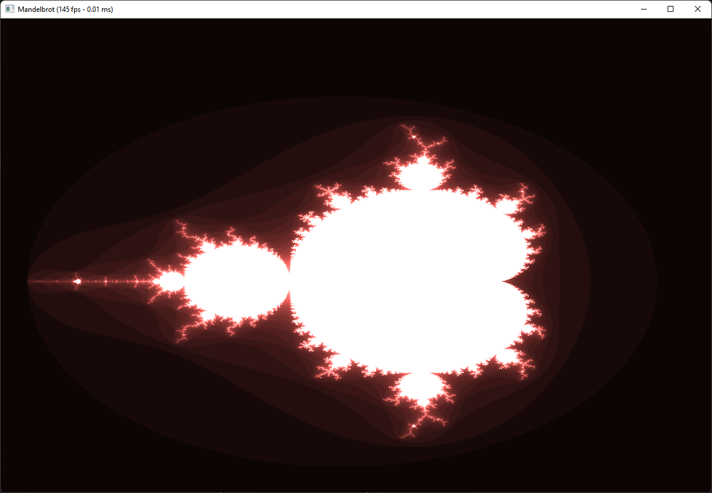

# Mandelbrot Set Visualizer

This project is a mandelbrot set visualizer on the GPU.
This project uses [vx_lib](https://github.com/BlackHole00/vx_lib).

See [this link](docs/documentation-it.md) for an (italian) documentation.

# Screenshots

